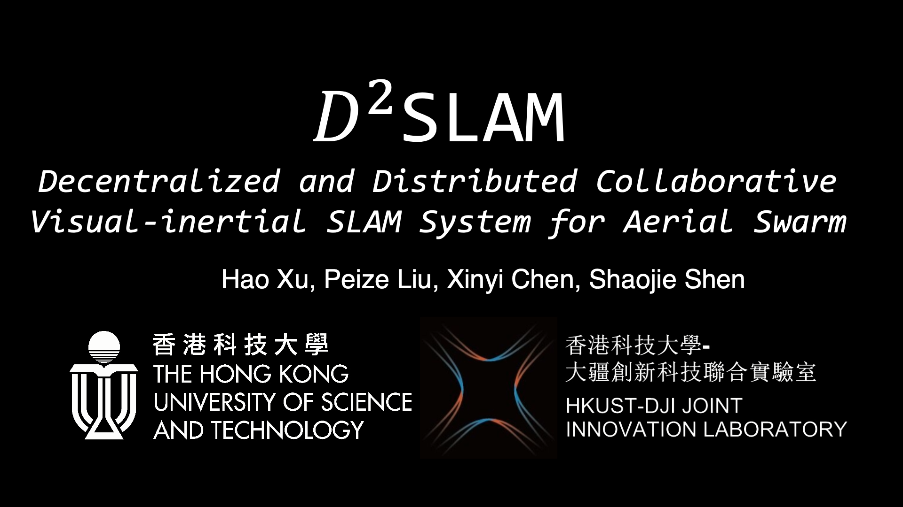
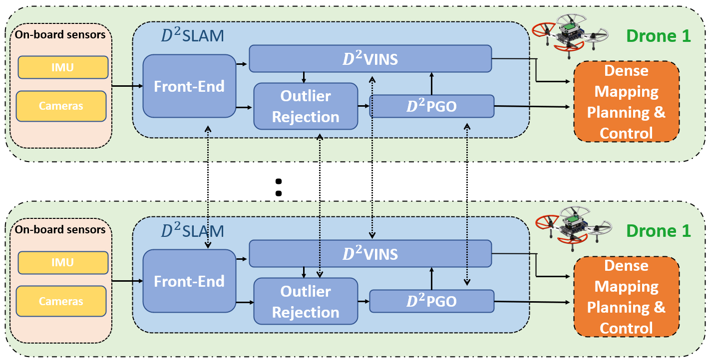
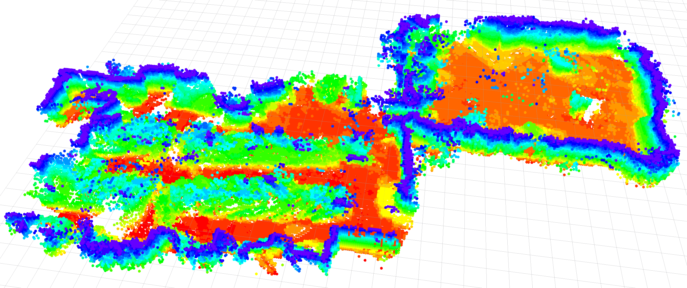

## Introduction
This is open-source code for **$D^2$ SLAM: Decentralized and Distributed Collaborative Visual-inertial SLAM System for Aerial Swarm**

<a href="https://www.youtube.com/embed/xbNAJP8EFOU" target="_blank"></a>

A crucial technology in fully autonomous aerial swarms is collaborative SLAM (CSLAM), which enables the estimation of relative pose and global consistent trajectories of aerial robots. 
However, existing CSLAM systems do not prioritize relative localization accuracy, critical for close collaboration among UAVs.
This paper and open-source project presents $D^2$ SLAM, a novel decentralized and distributed ($D^2$) CSLAM system that covers two scenarios: near-field estimation for high accuracy state estimation in close range and far-field estimation for consistent global trajectory estimation. 





We argue $D^2$SLAM can be applied in a wide range of real-world applications.

Our pre-print paper is currently available at [IEEE TRO](https://ieeexplore.ieee.org/document/10582478)

Citation:
```
@ARTICLE{10582478,
  author={Xu, Hao and Liu, Peize and Chen, Xinyi and Shen, Shaojie},
  journal={IEEE Transactions on Robotics}, 
  title={$D^{2}$SLAM: Decentralized and Distributed Collaborative Visual-Inertial SLAM System for Aerial Swarm}, 
  year={2024},
  volume={40},
  number={},
  pages={3445-3464},
  keywords={Simultaneous localization and mapping;Robots;Location awareness;State estimation;Accuracy;Optimization;Task analysis;Aerial systems: perception and autonomy;multirobot systems;simultaneous localization and mapping (SLAM);swarms},
  doi={10.1109/TRO.2024.3422003}}
```

## Build
To run $D^2$ SLAM, CUDA support is currently necessary for front-end acceleration. 
$D^2$ SLAM has numerous dependencies, and we recommend compiling $D^2$ SLAM using our Docker image. We provide two Docker images, one for PC and one for the embedded platform, Nvidia Jetson. We have evaluated $D^2$ SLAM on Nvidia Xavier NX.

For details on Docker image compilation, please refer to the [documentation](./docker/README.md).

After building the Docker image, you will also need to [download the CNN models](https://www.dropbox.com/s/gcd0768vcclc9vj/models.zip?dl=0) and put them in the D2SLAM folder.

## Usage
$D^2$ SLAM supports running as a collaborative or mono-robot SLAM system. To start it, simply run:
```
$ roslaunch d2vins quadcam.launch enable_pgo:=true enable_loop:=true # Start with quad-camera omni-directional system, with loop closure detection and $D^2$ PGO enabled
$ roslaunch d2vins tum.launch # Evaluate on TUM datasets
$ roslaunch d2vins realsense.launch # Use RealSense stereo camera
```
## Config
Major configuration files are located in a YAML file. When starting the roslaunch file, you can specify the path by:
```
roslaunch d2vins quadcam.launch config:=your-path-to-config/realsense_d435/d435_single.yaml
```

$D^2$ SLAM is highly configurable, which means there are tens of parameters that can be modified. An example is provided below:
```
%YAML:1.0

#inputs
imu: 1   # 1 or 0. If 1, the IMU data will be used to estimate the odometry
imu_topic: "/dji_sdk_1/dji_sdk/imu" # The ROS topic for IMU.
image0_topic: "/arducam/image" # The ROS topic for image0. In quad-camera mode, four images are concatenated as a single image.

is_compressed_images: 1 # I1 or 0. If 1, D2SLAM will attempt to read topics like /arducam/image/compressed. This parameter should not be enabled in real-world experiments.

imu_freq: 400 # The frequency of the IMU.
image_freq: 16 # The frequency of the input images.
frame_step: 2 #  D2SLAM will skip frame_step-1 number of frames to estimate the odometry.

#Camera configuration
camera_configuration: 3  #STEREO_PINHOLE = 0, STEREO_FISHEYE = 1 (Currently unsupported), PINHOLE_DEPTH = 2 (Only available for VIO), FOURCORNER_FISHEYE = 3
calib_file_path: "quad_cam_calib-camchain-imucam-7-inch-n3.yaml" #  The path to the camera calibration file.
image_width: 1280 # The width of the input images.
image_height: 800 # The height of the input images.
enable_undistort_image: 1 # 1 or 0. If 1, the image will be reprojected. This parameter only works for quad-cam mode.
undistort_fov: 200 # The field of view (FoV) for the reprojected image.
width_undistort: 800 # The width of the reprojected image
height_undistort: 400 # The height of the reprojected image.
photometric_calib: "mask.png" # The path to the photometric calibration file. This parameter only works for quad-cam mode.
avg_photometric: 0.7 # The average photometric when applying the photometric calibration file.

#estimation
estimate_extrinsic: 0   # 1 or 0. If 1, the camera extrinsic will be estimated. This parameter is only available for mono-robot mode and should not be enabled when operating using multiple robots.
estimate_td: 0                      #  1 or 0. If 1, the time offset between the camera and IMU will be estimated. This parameter is only available for mono-robot mode.
td: -0.186                           # The time offset initialization value.
estimation_mode: 2                  # The estimation mode. 
# Available options are 0 (D2VINS works as mono-robot VIO), 1 (each D2VINS instance estimates all robots in the swarm with all information it found), 
# 2 (distributed estimation mode, should be used in real-world experiments), and SERVER_MODE (D2VINS works as a server to collect information from the network and estimate the states, but not read data locally).
double_counting_common_feature: 0 # 1 or 0. If 1, common features will be double counted. This parameter is for debugging only.

#optimization parameters
max_solver_time: 0.08 # The maximum time allowed for each iteration of the solver (in ms).
max_num_iterations: 8   # The maximum number of iterations allowed for the solver.
consensus_max_steps: 1 # The number of sub-steps in ADMM; 1 is ok, set to bigger will bring overhead
timout_wait_sync: 50 # This parameter specifies the wait time in milliseconds for D2VINS to synchronize with other components in sync mode.
rho_landmark: 1.0 # $\rho$ value used for landmark estimation in D2SLAM.
rho_frame_T: 100  # $\rho$ value used for translation estimation in D2SLAM.
rho_frame_theta: 100 # $\rho$ value used for rotation estimation in D2SLAM.
relaxation_alpha: 0. # This parameter is used in the relaxation ADMM algorithm for debugging purposes.
consensus_sync_for_averaging: 0 # This parameter specifies the synchronization method used for averaging in D2SLAM.
consensus_sync_to_start: 0 # This parameter specifies whether to synchronize at the start of solving in D2SLAM.
#depth fusing
depth_far_thres: 3.0 # This parameter specifies the maximum depth in the frontend when using a depth camera in D2SLAM.
depth_near_thres: 0.3  # This parameter specifies the minimum depth when using a depth camera in D2SLAM.
fuse_dep: 0 # This parameter specifies whether to fuse depth measurements when using a depth camera in D2SLAM.
max_depth_to_fuse: 5.0 # This parameter specifies the maximum depth for depth measurement fusion in the backend of D2SLAM.
min_depth_to_fuse: 0.3 # This parameter specifies the minimum depth for depth measurement fusion in the backend of D2SLAM.

#Multi-drone
track_remote_netvlad_thres: 0.8 # This parameter specifies the NetVLAD threshold for invoking remote feature tracking in multi-drone environments.

#Initialization
init_method: 0 #This parameter specifies whether to use IMU or PnP to initialize new frames in D2SLAM. IMU is faster. 0 IMU, 1 PnP
depth_estimate_baseline: 0.03 # This parameter specifies the baseline threshold for allowing the estimation of landmarks in D2SLAM.

#sliding window
max_sld_win_size: 11 # This parameter specifies the maximum length of the sliding window in D2SLAM.
landmark_estimate_tracks: 4 # This parameter specifies the threshold for the number of measurements of a landmark to be used for estimation in D2SLAM.
min_solve_frames: 6 # This parameter specifies the number of keyframes in the sliding window to start the estimation process in D2SLAM.

#solver
multiple_thread: 1 #  This parameter specifies whether to use multiple threads in the Ceres solver in D2VINS.

#outlier rejection
thres_outlier : 10.0 # This parameter specifies the threshold to enable outlier detection in D2SLAM.
perform_outlier_rejection_num: 100 # The minimum number of landmarks to allow performing outlier rejection.
tri_max_err: 0.2 # The threshold for a good triangluation in initialization of landmarks.

#Marginalization
enable_marginalization: 1 # If enable marginalization.
margin_sparse_solver: 0 # If using sparse solvers (e.g. LLT) in marginalization
always_fixed_first_pose: 0 # By enable this, we fixed the first pose in sliding window and disable marginalization. Debug only.
remove_base_when_margin_remote: 2
#  When set to 2, will use the all relevant measurements of the removing frames to compute the prior,
# and the baseFrame (where!=removeID) will not be removed. This may lead to double counting of this baseFrame measurement: but it's stable.
#  When set to 1, will remove the baseframe's measurements of those measurements which is not base on current frame.
#  set to 0 those measurements (which on a landmark's baseFrame is not been removed) will be ignore.

#feature tracker parameters
max_cnt: 150            # max feature number in feature tracking per camera view
max_superpoint_cnt: 99 # max feature extraction by superpoint
max_solve_cnt: 200 # How many landmarks been solve $\tau_l$ in the paper.
max_solve_measurements: 1000 # How may measurements allow, $\tau_m$ in the paper.
check_essential: 1 # Outlier rejection by check the essential matrix in remote feature matching.
enable_lk_optical_flow: 1 #1 to enable lk opticalflow featuretrack to enhance ego-motion estimation.
remote_min_match_num: 20 # Threshold for good remote feature tracking
enable_superglue_local: 0 # 1 to enable SuperGlue for local feature matching, EXTREME SLOW but more robust.
enable_superglue_remote: 0 # 1 to enable SuperGlue for remote feature matching, EXTREME SLOW but more robust.
ransacReprojThreshold: 10.0 # Ransac threshold
enable_search_local_aera: 1 # When perform local feature matching, enable searching features in a small aera. Good for robustness.
search_local_max_dist: 0.03 # How big the aera is
feature_min_dist: 30 # Minimum distance to detect new featuresc between each others
parallex_thres: 0.012 # Minimum parallex threshold to create new keyframe 
knn_match_ratio: 0.8 #kNN match ratio test threshold, This apply to superpoint feature track & loop clouse detection.

#CNN
cnn_use_onnx: 1 # If use ONNX backend for CNN. Always 1
enable_pca_superpoint: 1 # Enable PCA for SuperPoint descriptor.
superpoint_pca_dims: 64 # Dims of SuperPoint descriptor after PCA.
enable_pca_netvlad: 1 # Enable PCA for NetVLAD descriptor.
netvlad_pca_dims: 1024 # Dims of NetVLAD descriptor after PCA.
cnn_enable_tensorrt: 1 # Enable TensorRT acceleration for ONNX.
cnn_enable_tensorrt_int8: 1 # Enable int8 mode for TensorRT.
netvlad_int8_calib_table_name: "mobilenetvlad_calibration.flatbuffers" # Calibration table for TensorRT, only for int8 mode
superpoint_int8_calib_table_name: "superpoint_calibration.flatbuffers" # Calibration table for TensorRT, only for int8 mode

acc_n: 0.1          # accelerometer measurement noise standard deviation. #0.2   0.04
gyr_n: 0.05         # gyroscope measurement noise standard deviation.     #0.05  0.004
acc_w: 0.002         # accelerometer bias random work noise standard deviation.  #0.002
gyr_w: 0.0004       # gyroscope bias random work noise standard deviation.     #4.0e-5
g_norm: 9.805         # gravity magnitude

#Loop Closure Detection
loop_detection_netvlad_thres: 0.8 # NetVlad threshold for invoking loop clousre detection
enable_homography_test: 0 # Enable homography in loop closure detection
accept_loop_max_yaw: 10 # Max delta yaw of detected loop.
accept_loop_max_pos: 1.0 # Max delta position of detected loop.
loop_inlier_feature_num: 50 # Threshold of inlier matched features for loop clousre detection
lazy_broadcast_keyframe: 0 # Set to 0, D2SLAM operating in Greedy mode; 1, D2SLAM operating in Compact mode.
gravity_check_thres: 0.03 # Threshold for gravity consistent checking

#PGO
pgo_solver_time: 0.5 # Max time to solve PGO each update in D2PGO 
pgo_mode: 1 # PGO MODE=0, D2PGO collects all information and solve it in non-distributed; 1: D2PGO works in distributed mode.
pgo_rho_frame_T: 0.84 # rho for translation
pgo_rho_frame_theta: 0.25 # rho for rotation
pgo_eta_k: 0.1 # eta_k for PGO
write_g2o: 1 # If output g2o file, debug only
g2o_output_path: "output.g2o" # PGO file path
write_pgo_to_file: 1 # If write pgo data as csv.


#outputs
output_path: "/root/output/" # Paths to output informations
debug_print_sldwin: 0 
debug_print_states: 0
enable_perf_output: 0
print_network_status: 0
debug_write_margin_matrix: 0
show_track_id: 0
```

## Evalution on single PC for multi-robot datasets
To evaluate multir-robot datasets on single PC, using our open-source tool at [sync_bag_player](https://github.com/HKUST-Swarm/sync_bag_player). 
It helps you to launch multiple docker container with same program. It could play multiple synced datasets to emulate multi-robot scenarios.
This tool is automatically install in our docker.

Please install it to your own ros workspace under **host** machine by cloning
```
cd your~workspace~/src/
git clone https://github.com/HKUST-Swarm/sync_bag_player
```

Launching the emulation is simple, just run with command:
```
$rosrun sync_bag_player environment_setup.sh
$rosrun sync_bag_player docker_swarm_test.py path~to~/d2vins.yaml
```
where yaml is defined as 
```yaml
dataset: # Specific datasets use for evaluation.
  swarm1: #drone 1
    id: 1
    config_path: "Configs/SwarmConfig1/" # This folder will be plug to /root/SwarmConfig
    bag: "drone1.bag"

  swarm2: #drone 2
    id: 2
    config_path: "Configs/SwarmConfig2/"
    bag: "drone2.bag"

  swarm3: #drone 3
    id: 3
    config_path: "Configs/SwarmConfig2/"
    bag: "drone3.bag"

output_path: "outputs/fuse_all/" # Output path of logs
workspace: "" # The workspace to load, leave it to empty if you do NOT compile code on host.
image_name: "xuhao1/d2slam:pc" # Docker image
exclude_topics: ["/uwb_node/incoming_broadcast_data"] # Exclude some topic while playing.
rate: 0.5 # Speed to play. 
t_start: 60 # Time of bag to start
duration: 1000 # Length of bag to run
start_latency: 15 # Wait seconds to launch

# Following is the script in docker, you may change it to test the D2SLAM
entry_point_script: |
  #!/bin/bash
  source /root/swarm_ws/devel/setup.bash # If you compile D2SLAM on host PC, make sure it's equal to __workspace__/devel/setup.bash, else this default value.
  rm -rf /root/output/loop/*
  mkdir -p /root/output/loop
  roslaunch d2vins realsense.launch self_id:=$DRONE_ID \
    config:=/root/SwarmConfig/realsense_d435/d435_single.yaml \ 
    enable_loop:=true enable_pgo:=true \
    rviz:=true
 ```

Good examples with various setups of YAMLs are locate in our datasets. We do not suggest you to run the evaluation very fast even on powerful PC. The dick IO will be the bottleneck.

## Datasets
Please download Quad-camera omnidirectional datasets at:
[link](https://www.dropbox.com/scl/fo/jtiwfx98ms7cty946nmug/h?dl=0&rlkey=n03gf3jqmthzy655ku0ycbny0)
or 

[aligned TUM Corr for multi-robot evaluation](https://www.dropbox.com/s/ic0yuxr2xym1m0c/tum_corr.7z?dl=0)

https://pan.baidu.com/s/1qyRUHUeVCvORXM4CrIZCxg?pwd=D2SL
提取码: D2SL

More datastes will be release very soon.

## License
LGPL-3
